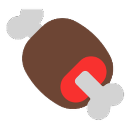
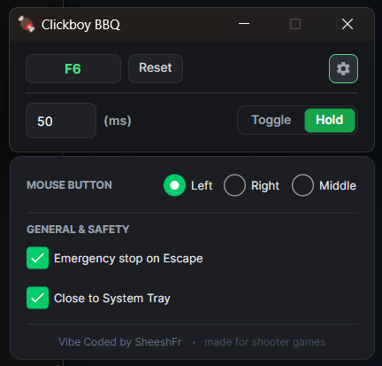

  
  <h1>Clickboy BBQ</h1>

  
  

  
I got tired of searching for decent auto-clickers so I made one for myself. Now my pistol is a machine gun in Remnant 2! B)

  
Vibe Coded by <a href="https://github.com/sheeshfr"><b>SheeshFr</b></a>

   

  

---

## How to Use

1. **Boot it up**
2. **Set the key you want**
3. **Change the interval** (`50ms` = 20 CPS / clicks per sec)
4. **Choose Toggle or Hold**:
   - **Toggle**: An on/off switch.
   - **Hold**: Active while the button is pressed, off when released.

---

## Download

Grab the latest ready-to-run **`Clickboy_BBQ_Release.zip`** from [**Releases**](https://github.com/sheeshfr/Clickboy_BBQ/releases/latest). Unzip and run!

---

## License

This project is licensed under the [GNU General Public License v3.0](LICENSE).
